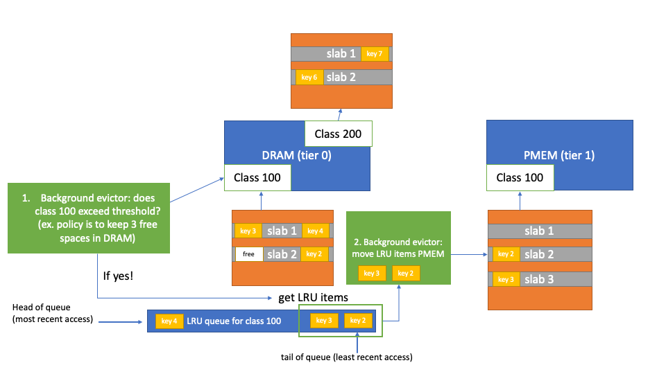

# Background Data Movement

In order to reduce the number of online evictions and support asynchronous
promotion - we have added two periodic workers to handle eviction and promotion.

The diagram below shows a simplified version of how the background evictor
thread (green) is integrated to the CacheLib architecture. 

  

## Background Evictors

The background evictors scan each class to see if there are objects to move the next (higher)
tier using a given strategy. Here we document the parameters for the different
strategies and general parameters. 

- `backgroundEvictorIntervalMilSec`: The interval that this thread runs for - by default
the background evictor threads will wake up every 10 ms to scan the AllocationClasses. Also,
the background evictor thead will be woken up everytime there is a failed allocation (from
a request handling thread) and the current percentage of allocated slabs for the 
AllocationClass exceed the `lowEvictionAcWatermark`. This may render the interval parameter
not as important when there are many allocations occuring from request handling threads. 

- `evictorThreads`: The number of background evictors to run - each thread is a assigned
a set of AllocationClasses to scan and evict objects from. Currently, each thread gets
an equal number of classes to scan - but as object size distribution may be unequal - future
versions will attempt to balance the classes among threads. The range is 1 to number of AllocationClasses. The default is 4, so each thread will get 6 classes by default. 

- `evictionHotnessThreshold`: The number of objects to remove in a given eviction call. The
default is 200. Lower range is 10 and the upper range is 1000. Too low and we might not
remove objects at a reasonable rate, too high and we hold the locks for copying data
between tiers for too long. 

### FreeThresholdStrategy (default)

- `evictionSlabWatermark`: Allows background eviction once this total percentage of slabs
allocated has been reached. This is precondition for background eviction to occur at all since
if there are unallocated slabs then those should be allocated before running any background
evictions. The default is `100` and probably shouldn't be changed much without good reason.

- `lowEvictionAcWatermark`: Triggers background eviction thread to run
when this percentage of the AllocationClass is allocated. 
The default is `98.0`, to avoid wasting capacity we don't set this below `90`.

- `highEvictionAcWatermark`: Stop the evictions from an AllocationClass when this 
percentage of the AllocationClass is allocated. The default is `95.0`, to avoid wasting capacity we
don't set this below `90`.

## Background Promoters

The background promotes scan each class to see if there are objects to move to a lower
tier using a given strategy. Here we document the parameters for the different
strategies and general parameters.

- `backgroundPromoterIntervalMilSec`: The interval that this thread runs for - by default
the background promoter threads will wake up every 10 ms to scan the AllocationClasses for
objects to promote.

- `promoterThreads`: The number of background promoters to run - each thread is a assigned
a set of AllocationClasses to scan and promote objects from. Currently, each thread gets
an equal number of classes to scan - but as object size distribution may be unequal - future
versions will attempt to balance the classes among threads. The range is 1 to number of AllocationClasses. The default is 4, so each thread will get 6 classes by default. 

- `evictionHotnessThreshold`: The number of objects to remove in a given eviction call. The
default is 200. Lower range is 10 and the upper range is 1000. Too low and we might not
remove objects at a reasonable rate, too high and we hold the locks for copying data
between tiers for too long. 

- `numDuplicateElements`: This allows us to promote items that have existing handles (read-only) since
we won't need to modify the data when a user is done with the data. Therefore, for a short time
the data could reside in both tiers until it is evicted from its current tier. The default is to
not allow this (0). Setting the value to 100 will enable duplicate elements in tiers.

### Background Promotion Strategy (only one currently)

- `promotionAcWatermark`: If the class for the next lower tier has at least this percentage of free
slabs, then the promotion thread will attempt to move `evictionHotnessThreshold` number of objects
to the next lower tier. The objects are chosen from the head of the LRU. The default is `97` so
promotion will only occur when there is at least 3% of the slabs for this class free. 

